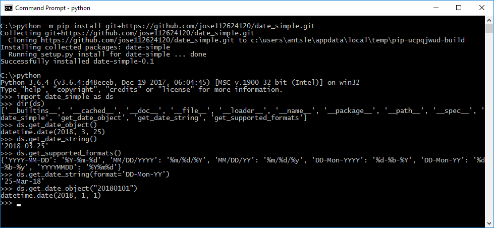

# date_simple

`date_simple` is a wrapper for Python's `datetime`, it contains functions for working with dates. The motivation for the module is to simplify the interface to Python's `datetime` module (which is simply designed, but still requires studying and remembering specialized syntax).

## Installation

### Istallation if cloning this repo
First, make sure you're in the same directory as setup.py.  Then from the Unix/Mac Terminal, or Windows Command Prompt :
```bash
$ git clone https://github.com/jose112624120/date_simple.git
$ cd date_simple
$ pip install .            
```

### Installation in one step
```bash
$ pip install git+https://github.com/jose112624120/date_simple.git
```
**Note**: if you can't run `pip` directly, then `pip` is not in your path, you can substitue `pip` with `python -m pip` to run `pip` as a module:



## Sample Usage

```python
import date_simple as ds

dateobj1 = ds.get_date_object()                      # datetime.date object for today
dateobj2 = ds.get_date_object(date='2018-02-26')     # datetime.date object for Feb 26, 2018

datestr = ds.get_date_string()                       # '2018-03-03'  (today's date)
datestr = ds.get_date_string(date_object=dateobj2)   # '2018-02-26'  (string date from date object)

datestr = ds.get_date_string(date_object=dateobj2, format='MM/DD/YYYY')  # 02/26/2018
datestr = ds.get_date_string(date_object=dateobj2, format='DD-Mon-YY')  # 26-Feb-18
```

Supported string values for format:

| format        | date_simple.get_date_string returns |
|--------------:|------------------------------------:|
|`YYYY-MM-DD`   | `2018-02-03`  |
|`MM/DD/YYYY`   | `02-03-2018`  |
|`MM/DD/YY`     | `02-03-08`    |
|`DD-Mon-YYYY`  | `03-Feb-2018` |
|`DD-Mon-YY`    | `03-Feb-08`   |
|`YYYYMMDD`     | `20180203`    |

If no format is specified `format='YYYY-MM-DD'` is defaulted.

## Running Tests

First, make sure you have the Python package [`pytest`](https://docs.pytest.org/en/latest/) installed. Then,  from the same directory as setup.py:
```bash
$ python setup.py pytest
``` 


## License

MIT


